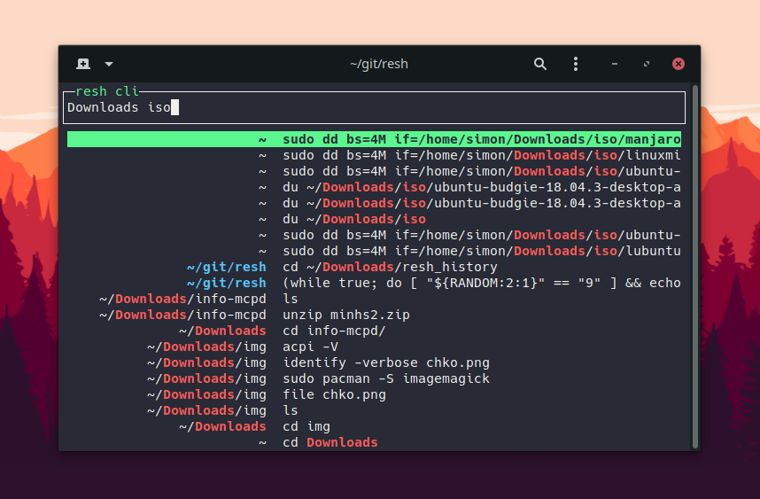

# Rich Enhanced Shell History

Context-based replacement/enhancement for zsh and bash shell history - :warning: *Work in progress*

## Motivation

When you execute a command in zsh or bash following gets recorded to your shell history:

- Command itself
- Date
- Duration of the command (only in zsh and only if enabled)

But shell usage is contextual - you probably use different commands based on additional context:

- Current directory
- Current git repository/origin
- Previously executed commands
- etc ...

Additionally it's annoying to not have your shell history follow you accros your devices.
Have you lost your history when reinstalling? I personally think this is unacceptable in 2019.

Why not synchronize your shell history accross your devices and add some metadata to know where it came from:

- Hostname
- Username
- Machine ID
- OS
- etc ...

Imagine being able to search your shell history based on both the command itself and all this additional metadata.

## What this project does

| | Legend |
| --- | --- |
| :heavy_check_mark: | Implemented |
| :white_check_mark: | Implemented but there are issues |
| :x: | Not implemented |

*NOTE: Features can change in the future*

- :heavy_check_mark: Record shell history with metadata
  - :heavy_check_mark: save it as JSON to `~/.resh_history.json`

- :white_check_mark: Provide bindings for arrow keys
  - :heavy_check_mark: imitate default behaviour
  - :heavy_check_mark: save additional metadata (e.g. command was recalled using arrow keys)
  - :x: use the context (metadata) when searching
  - :heavy_check_mark: zsh
  - :white_check_mark: bash *(performance issues)*

- :white_check_mark: Provide an app to search the history (launch it using `resh`)
  - :heavy_check_mark: provide binding for Control+R (enable it using `reshctl enable ctrl_r_binding_global`)
  - :white_check_mark: allow searchnig by metadata (only command and directory so far)
  - :x: app contians different search modes

- :heavy_check_mark: Provide a `reshctl` utility to control and interact with the project
  - :heavy_check_mark: zsh completion
  - :heavy_check_mark: bash completion

- :x: Synchronize recorded history between devices

- :x: Provide an API to make resh extendable

- :heavy_check_mark: Support zsh and bash

- :heavy_check_mark: Support Linux and macOS  

- :white_check_mark: Require very little prerequisite software
  - :heavy_check_mark: Linux
  - :white_check_mark: MacOS *(requires coreutils - `brew install coreutils`)*

- :white_check_mark: Show cool graphs based on recorded history

- :heavy_check_mark: Provide a tool to sanitize the recorded history

## Data sanitization and analysis

In order to be able to develop a good history tool I will need to get some insight into real life shell and shell history usage patterns.

This project is also my Master thesis so I need to be a bit scientific and base my design decisions on evidence/data.

Running `reshctl sanitize` creates a sanitized version of recorded history.  
In sanitized history, all sensitive information is replaced with its SHA1 hashes.

If you tried sanitizing your history and you think the result is not sanitized enough then please create an issue or message me.

If you would consider supporting my research/thesis by sending me a sanitized version of your history then please give me some contact info using this form: https://forms.gle/227SoyJ5c2iteKt98

## Prereqisities

Standard stuff: `bash`, `curl`, `tar`, ...

Additional prerequisities: `bash-completion` (if you use bash)

MacOS: `coreutils` (`brew install coreutils`)

## Installation

### Simplest

Run this command.

```sh
curl -fsSL https://raw.githubusercontent.com/curusarn/resh/master/scripts/rawinstall.sh | bash
```

### Simple

1. Run `git clone https://github.com/curusarn/resh.git && cd resh`
2. Run `scripts/rawinstall.sh`

## Examples

### Update

Check for updates and update

```sh
reshctl update
```

### RESH CLI tool

RESH CLI searches your history by commands and directories.  

Directories are not in regular shell history. Because of that RESH CLI will only search shell history recorded by this project.
This means that you should install this project now and try out RESH CLI in a month or so.

*Please remember that RESH CLI is an early prototype.*



RESH CLI tool can be bound to ctrl+R or executed directly.

Enable/disable ctrl+R bindnig for THIS shell session:

```sh
reshctl enable ctrl_r_binding
reshctl disable ctrl_r_binding
```

Enable/disable for FUTURE shell sessions:

```sh
reshctl enable ctrl_r_binding_global
reshctl disable ctrl_r_binding_global
```

Run the RESH CLI tool as a one-off:

```sh
resh
```

### Arrow key bindings

Resh provides arrow key bindings.

These bindings do regular stepping through history and prefix search.

They allow resh to record bindings usage metadata.


*In example above I pressed UP, pressed DOWN, pressed UP (prefix search `make`) and the command line after the last command line retrieved from history was `make build` so we see that I executed the retrieved command without editing it.*

Arrow key bindings are enabled by default in zsh and they are disabled by default in bash because there are some performance issues.

Enable/disable arrow key bindnigs for THIS shell session:

```sh
reshctl enable arrow_key_bindings

reshctl disable arrow_key_bindings
```

Enable/disable for FUTURE shell sessions:

```sh
reshctl enable arrow_key_bindings_global

reshctl disable arrow_key_bindings_global
```

See what your current setting is:

```sh
reshctl status
```

### View the recorded history

Resh history is saved to `~/.resh_history.json`

Each line is a JSON that represents one executed command line.

This is how I view it `tail -f ~/.resh_history.json | jq` or `jq < ~/.resh_history.json`.  

You can install `jq` using your favourite package manager or you can use other JSON parser to view the history.


*Recorded metadata will be reduced to only include useful information in the future.*

### Graphs

:clock10: *coming soon-ish (working on other parts of the project atm)*

Sneak peak


## Known issues

### Q: I use bash on macOS and resh doesn't work

**A:** You have to add `[ -f ~/.bashrc ] && . ~/.bashrc` to your `~/.bash_profile`.  

**Long Answer:** Under macOS bash shell only loads `~/.bash_profile` because every shell runs as login shell. I will definitely work around this in the future but since this doesn't affect many people I decided to not solve this issue at the moment.

## Issues

You are welcome to create issues: https://github.com/curusarn/resh/issues

## Uninstallation

You can uninstall this project at any time by running `rm -rf ~/.resh/`

You won't lose any recorded history by removing `~/.resh` directory because history is saved in `~/.resh_history.json`.
