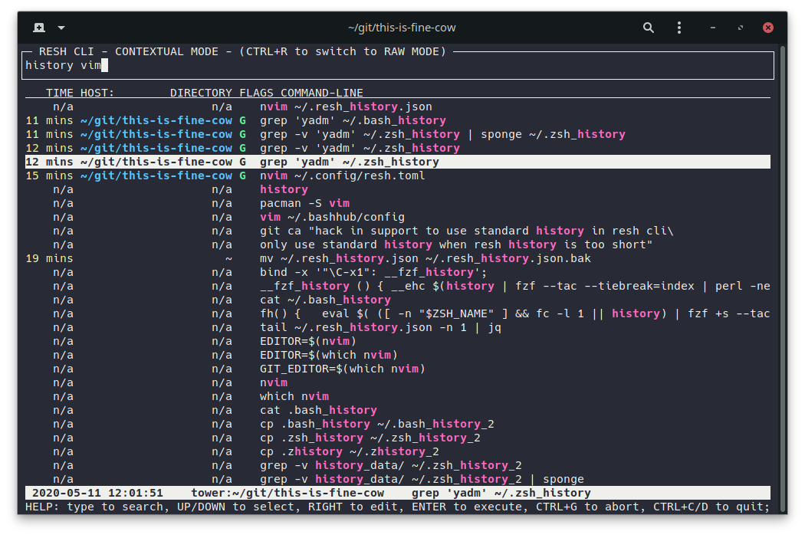
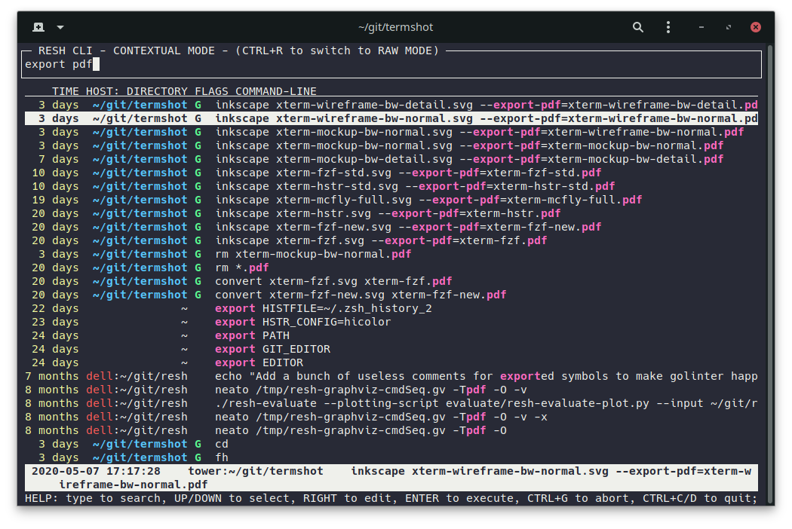
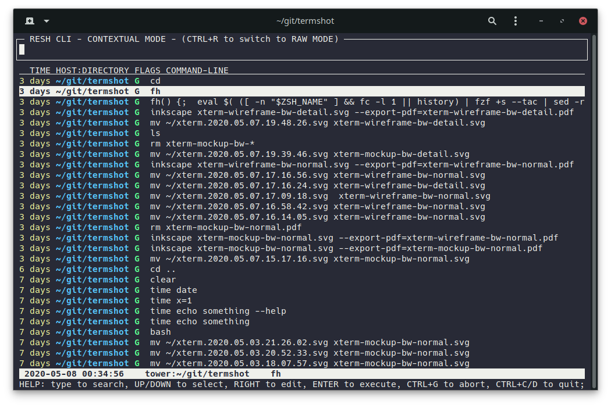
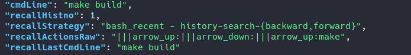

# Rich Enhanced Shell History

Context-based replacement/enhancement for zsh and bash shell history - :warning: *Work in progress*
<!-- Contextual shell history -->
<!-- Contextual bash history -->
<!-- Contextual zsh history -->
<!-- Context-based shell history -->
<!-- Context-based bash history -->
<!-- Context-based zsh history -->
<!-- Better shell history -->
<!-- Better bash history -->
<!-- Better zsh history -->
<!-- PWD Directory -->


## Motivation

When you execute a command in zsh or bash following gets recorded to your shell history:

- Command itself
- Date
- Duration of the command (only in zsh and only if enabled)

But shell usage is contextual - you probably use different commands based on additional context:

- Current directory
- Current git repository/origin
- Previously executed commands
- etc ...

Additionally it's annoying to not have your shell history follow you accros your devices.
Have you lost your history when reinstalling? I personally think this is unacceptable in 2020.

Why not synchronize your shell history accross your devices and add some metadata to know where it came from:

- Hostname
- OS
- etc ...

Imagine being able to search your shell history based on both the command itself and all this additional metadata.

## What this project does

| | Legend |
| --- | --- |
| :heavy_check_mark: | Implemented |
| :white_check_mark: | Implemented but I'm not happy with it |
| :x: | Not implemented |

*NOTE: Features can change in the future*

- :heavy_check_mark: Record shell history with metadata
  - :heavy_check_mark: save it as JSON to `~/.resh_history.json`

- :white_check_mark: Provide an app to search the history
  - :heavy_check_mark: launch with CTRL+R (enable it using `reshctl enable ctrl_r_binding_global`)
  - :heavy_check_mark: search by keywords
  - :heavy_check_mark: relevant results show up first based on context (host, directory, git, exit status)
  - :heavy_check_mark: allow searching completely without context ("raw" mode)
  - :heavy_check_mark: import and search history from before RESH was installed
  - :white_check_mark: include a help with keybindings
  - :x: allow listing details for individual commands
  - :x: allow explicitly searching by metadata

- :white_check_mark: Provide bindings for arrow keys
  - :heavy_check_mark: imitate default behaviour (serve recent history)
  - :heavy_check_mark: built-in prefix search 
  - :heavy_check_mark: serve fully dedupicated history
  - :x: use arrow down for easy sequence repeating
  - :heavy_check_mark: zsh
  - :white_check_mark: bash *(off by deafult because of bash performance issues)*

- :heavy_check_mark: Provide a `reshctl` utility to control and interact with the project
  - :heavy_check_mark: turn on/off resh key bindings
  - :heavy_check_mark: zsh completion
  - :heavy_check_mark: bash completion

- :x: Multi-device history
  - :x: Synchronize recorded history between devices
  - :x: Allow proxying history when ssh'ing into remote servers

- :x: Provide a stable API to make resh extensible

- :heavy_check_mark: Support zsh and bash

- :heavy_check_mark: Support Linux and macOS

- :white_check_mark: Require only essential prerequisite software
  - :heavy_check_mark: Linux
  - :white_check_mark: MacOS *(requires coreutils - `brew install coreutils`)*

- :heavy_check_mark: Provide a tool to sanitize the recorded history

## Prereqisities

Standard stuff: `bash`, `curl`, `tar`, ...

Bash completions will only work if you have `bash-completion` installed

MacOS: `coreutils` (`brew install coreutils`), `bash4.3+` is recommended

## Installation

### Simplest

Run this command.

```sh
curl -fsSL https://raw.githubusercontent.com/curusarn/resh/master/scripts/rawinstall.sh | bash
```

### Simple

1. Run `git clone https://github.com/curusarn/resh.git && cd resh`
2. Run `scripts/rawinstall.sh`

## Examples

### Update

Check for updates and update

```sh
reshctl update
```

### RESH SEARCH application

RESH SEARCH app searches your history by commands. It uses host, directories, git remote, and exit status to show you relevant results first.  

All this context is not in the regular shell history. RESH records shell history with context to use it when searching.

At first, the search application will look something like this. Some history with context and most of it without. As you can see, you can still search the history just fine.



Eventually most of your history will have context and RESH SEARCH app will get more useful.



Without a query, RESH SEARCH app shows you the latest history based on the current context (host, directory, git).



RESH SEARCH app replaces the standard reverse search - launch it using Ctrl+R.

Enable/disable the Ctrl+R keybinding:

```sh
reshctl enable ctrl_r_binding
reshctl disable ctrl_r_binding
```

You can also run the RESH SEARCH app directly as a one-off:

```sh
resh
```

NOTE: One feature is not available when running RESH SEARCH app directly  - arrow right won't paste the selected command onto the command line for editing.

### Arrow key bindings

Resh provides arrow key bindings.

These bindings provide regular stepping through history and prefix search.
They also fully deduplicate the served history.

They allow resh to record bindings usage metadata.



*In example above I pressed UP, pressed DOWN, pressed UP (prefix search `make`) and the command line after the last command line retrieved from history was `make build` so we see that I executed the retrieved command without editing it.*

Arrow key bindings are enabled by default in zsh and they are disabled by default in bash because there are some performance issues.

Enable/disable arrow key bindings:

```sh
reshctl enable arrow_key_bindings

reshctl disable arrow_key_bindings
```

See what your current setting is:

```sh
reshctl status
```

### View the recorded history

Resh history is saved to `~/.resh_history.json`

Each line is a JSON that represents one executed command line.

This is how I view it `tail -f ~/.resh_history.json | jq` or `jq < ~/.resh_history.json`.  

You can install `jq` using your favourite package manager or you can use other JSON parser to view the history.


*Recorded metadata will be reduced to only include useful information in the future.*

## Data sanitization and analysis

In order to be able to develop a good history tool I will need to get some insight into real life shell and shell history usage patterns.

This project is also my Master thesis so I need to be a bit scientific and base my design decisions on evidence/data.

Running `reshctl sanitize` creates a sanitized version of recorded history.  
In sanitized history, all sensitive information is replaced with its SHA256 hashes.

If you tried sanitizing your history and you think the result is not sanitized enough then please create an issue or message me.

If you would consider supporting my research/thesis by sending me a sanitized version of your history then please give me some contact info using this form: https://forms.gle/227SoyJ5c2iteKt98

## Known issues

### Q: I use bash on macOS and resh doesn't work

**A:** You have to add `[ -f ~/.bashrc ] && . ~/.bashrc` to your `~/.bash_profile`.  

**Long Answer:** Under macOS bash shell only loads `~/.bash_profile` because every shell runs as login shell. I will definitely work around this in the future but since this doesn't affect many people I decided to not solve this issue at the moment.

## Issues and ideas

Please do create issues if you encounter any problems or if you have a suggestions: https://github.com/curusarn/resh/issues

## Uninstallation

You can uninstall this project at any time by running `rm -rf ~/.resh/`

You won't lose any recorded history by removing `~/.resh` directory because history is saved in `~/.resh_history.json`.
