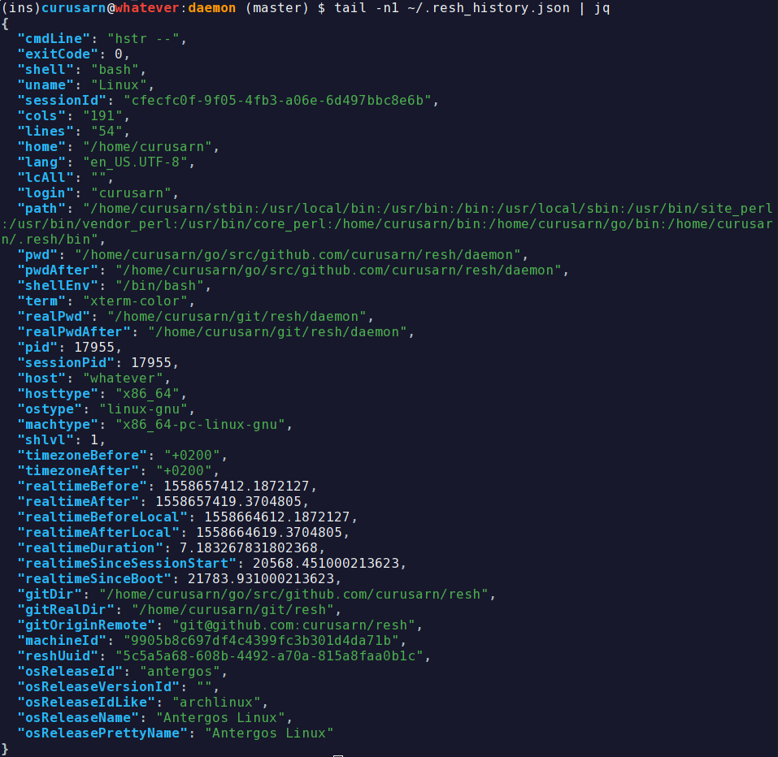

# Rich Enhanced Shell History

## What

This project is the first phase of my master thesis.

It records shell history with rich set of metadata and saves it locally. (see example below)

It doesn't change the way your shell and your shell history behaves.

You won't notice any delay in your shell (~40ms).

If you are not happy with it you can uninstall it with a single command (`rm -rf ~/.resh`).

## Why

The ultimate point of my thesis is to provide a drop-in replacement for bash and zsh shell history.

The idea is to provide following:
- Context-based history
- Simple way to search whole history by command itself and/or metadata
- Synchronization across devices
- And more ...

In order to be able to develop a good history tool I will need to get some insight into real life shell usage patterns.

That's why I ask YOU to install this tool to locally record your shell history. 

After some time (probably a few months) I will create a script to replace anything too personal in the recorded data by placeholders. 

Then I will ask you to run the script against the recorded data and tell me if you are willing to share the resluts with me.

I'm very thankful for anyone who is willing to support my thesis by providing their usage data!

If you install RESH, please give me some contact info using this form: https://forms.gle/227SoyJ5c2iteKt98 

## Prereqisities

- `git`
- `golang` (>1.11 if possible but we can deal with old ones as well)

## Installation

### Simplest
Just run `bash -c "$(wget -O - https://raw.githubusercontent.com/curusarn/resh/master/rawinstall.sh)"` from anywhere.

### Simple
1. Run `git clone https://github.com/curusarn/resh.git && cd resh`
2. Run `make autoinstall` for assisted build & instalation.
    - OR Run `make install` if you know how to build Golang projects.

If you install RESH, please give me some contact info using this form: https://forms.gle/227SoyJ5c2iteKt98 

## Compatibility

Works in `bash` and `zsh`.

Tested on:
- Arch
- MacOS
- Ubuntu (18.04)
- really old Ubuntu (16.04)

## Examples

Resh history is saved to `~/.resh_history.json`

Each line is a JSON that represents one executed command line.

This is how I view it `tail -f ~/.resh_history.json | jq` or `jq < ~/.resh_history.json`.  

You can install `jq` using your favourite package manager or you can use other JSON parser to view the history.

## Known issues

### Q: I use bash on macOS and resh doesn't work

**A:** You have to add `[ -f ~/.bashrc ] && . ~/.bashrc` to your `~/.bash_profile`.  

**Long Answer:** Under macOS bash shell only loads `~/.bash_profile` because every shell runs as login shell. I will definitely work around this in the future but since this doesn't affect many people I decided to not solve this issue at the moment.

## Issues

You are welcome to create issues: https://github.com/curusarn/resh/issues

## Uninstallation

You can uninstall this project at any time by running `rm -rf ~/.resh/`

You won't lose any recorded history by removing `~/.resh` directory because history is saved in `~/.resh_history.json`.
